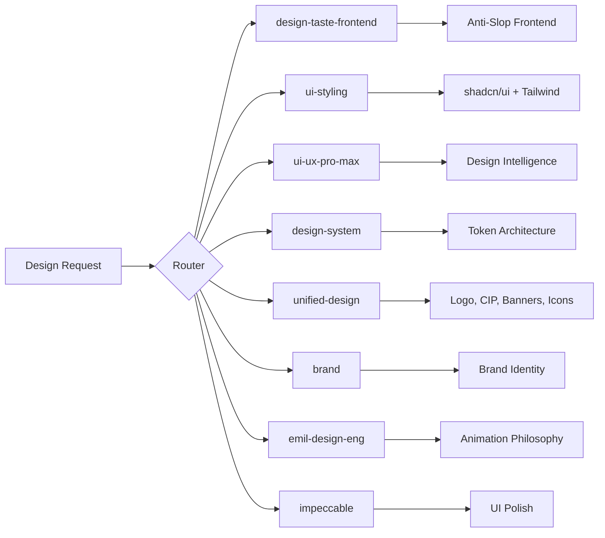
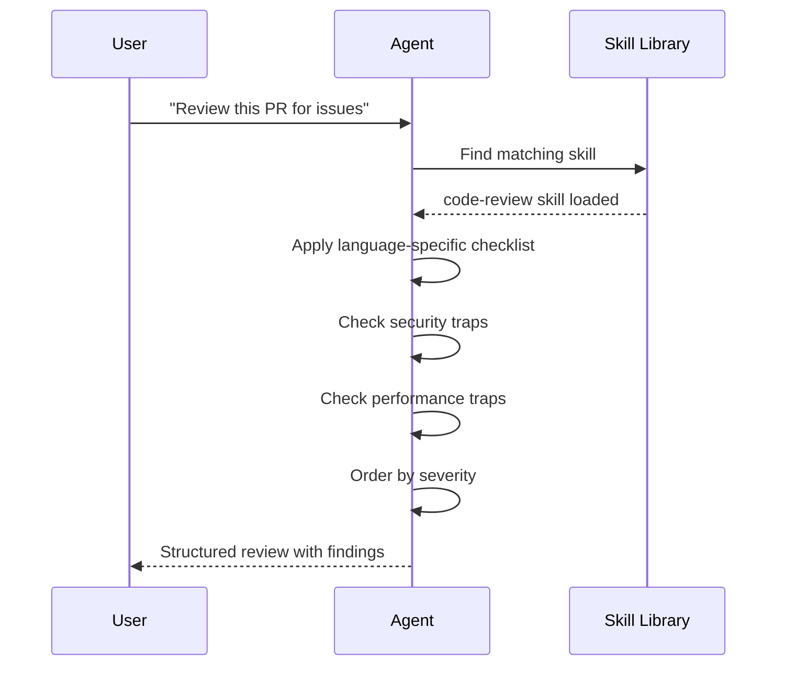

<div align="center">

<!-- Logo & Title -->


# **Skill is All you Need**

### The Ultimate AI Agent Skill Library

*26 battle-tested skills for Claude, ChatGPT, and any AI agent.*

[](https://github.com/shivamsingh-007/Skill-is-All-you-Need/stargazers)
[](https://github.com/shivamsingh-007/Skill-is-All-you-Need/network/members)
[](https://github.com/shivamsingh-007/Skill-is-All-you-Need/issues)
[](LICENSE)
[](#-skill-categories)

<br />

<!-- Animated Banner -->


</div>

---

## 🤔 Why This Exists

AI agents are powerful, but they **repeat the same mistakes** without structured guidance. This library gives your agent **26 focused skills** that:

> *"A skill earns its place by improving quality, reducing variance, encoding preferred structure, or preventing repeat mistakes."*

```
Without Skills                    With Skills
┌─────────────────────┐          ┌─────────────────────┐
│  Vague, generic     │          │  Precise, actionable │
│  output every time  │   ──►   │  output with checks  │
│  Misses edge cases  │          │  Catches edge cases  │
│  No structure       │          │  Consistent format   │
└─────────────────────┘          └─────────────────────┘
```

---

## 📊 Skill Overview

<div align="center">

| Category | Skills | Impact |
|:--------:|:------:|:------:|
| 🔧 Engineering | 4 | Build better code |
| 🤖 AI / ML | 4 | Smarter systems |
| 🎨 Design | 8 | Beautiful interfaces |
| 🧠 Coaching | 3 | Clear thinking |
| 📝 Content | 1 | Better docs |
| ⚙️ Ops | 1 | Safer deploys |
| 🎬 AI Media | 1 | Creative content |
| 🧩 Meta | 4 | Skill management |

</div>

---

## 🔧 Engineering Core

> *The 4 skills every developer needs.*

<details>
<summary><strong>🐛 Bug Debugging</strong> — Find root causes fast</summary>

<br />

**What it does:** Systematic debugging with failure-mode taxonomies for Node.js, Python, and Go.

**Includes:**
- Failure-mode lookup tables by stack
- Reproduction time budgets
- Log triage order
- Rollback rules by severity
- Bug reproduction from tickets

**Example trigger:** *"Debug this failing test"* / *"Why is the API returning 500?"*

</details>

<details>
<summary><strong>🔍 Code Review</strong> — Catch issues before merge</summary>

<br />

**What it does:** Language-specific checklists, security traps, performance traps.

**Includes:**
- TypeScript / Python / Go checklists
- Security trap detection
- Performance trap detection
- Severity ordering (bugs > regressions > security > tests)

**Example trigger:** *"Review this PR"* / *"Check this diff for issues"*

</details>

<details>
<summary><strong>📋 Implementation Planning</strong> — Build in the right order</summary>

<br />

**What it does:** Slice sizing, dependency mapping, rollback-aware sequencing, risk scoring.

**Includes:**
- Slice sizing heuristics (1-2 hours to 1-2 weeks)
- Dependency mapping rules
- Rollback-aware sequencing
- Risk scoring (blast radius × data impact × reversibility)

**Example trigger:** *"Plan this feature"* / *"Break down this project"*

</details>

<details>
<summary><strong>🧪 Test Generation</strong> — Tests that actually catch bugs</summary>

<br />

**What it does:** Framework-specific patterns, fixture strategies, flaky test anti-patterns.

**Includes:**
- Jest / Vitest patterns
- pytest patterns
- Go test patterns (table-driven)
- Fixture strategy (inline, factory, snapshot, database)
- Flaky test detection

**Example trigger:** *"Write tests for this function"* / *"Add regression tests"*

</details>

---

## 🤖 AI / ML

> *Skills for building and evaluating AI systems.*

<details>
<summary><strong>📊 RAG Evaluation</strong> — Is your RAG actually grounded?</summary>

<br />

**What it does:** Retrieval quality metrics, grounding failure taxonomy, evaluation templates.

**Includes:**
- Precision@K, Recall@K, MRR, NDCG targets
- Hallucination / contradiction / irrelevance detection
- Inspection checklist

**Example trigger:** *"Check if this RAG output is hallucinated"* / *"Evaluate retrieval quality"*

</details>

<details>
<summary><strong>📈 Agent Evals</strong> — Measure what matters</summary>

<br />

**What it does:** Eval case templates, success metrics, failure buckets, benchmark analysis, tool-use auditing.

**Includes:**
- Eval case YAML templates
- Task completion, format compliance, content accuracy targets
- Failure bucket schemas
- Benchmark regression analysis
- Tool-use audit checklist

**Example trigger:** *"Create eval suite for this agent"* / *"Analyze these benchmark results"*

</details>

<details>
<summary><strong>🎯 Hallucination Debugging</strong> — Find where reality breaks</summary>

<br />

**What it does:** Systematic debugging of AI hallucinations and unsupported claims.

**Example trigger:** *"This output seems made up"* / *"Find the hallucination source"*

</details>

<details>
<summary><strong>🔗 Context Pipeline Review</strong> — Right info, right order</summary>

<br />

**What it does:** Pipeline inspection checklists, failure patterns, optimization strategies.

**Includes:**
- 11-stage pipeline inspection
- Common failure patterns (keyword mismatch, over/under-retrieval)
- Optimization strategies (top-K, reranker, HyDE, multi-query)

**Example trigger:** *"Review my context assembly"* / *"Why is the model ignoring the context?"*

</details>

---

## 🎨 Design (8 Skills)

> *From anti-slop frontends to design systems.*

<div align="center">



</div>

<details>
<summary><strong>🎯 Design Taste Frontend</strong> — The anti-slop skill (9/10)</summary>

<br />

**What it does:** Landing pages, portfolios, and redesigns that don't look AI-generated.

**Key features:**
- 3 dials: DESIGN_VARIANCE, MOTION_INTENSITY, VISUAL_DENSITY
- Brief inference before code
- Anti-default discipline (no AI-purple gradients)
- Typography rules (serif discipline, Inter discouraged)
- Color calibration (premium-consumer palette ban)
- Layout discipline (hero rules, bento grids, eyebrow restraint)

**Example trigger:** *"Build a landing page"* / *"Redesign this portfolio"*

</details>

<details>
<summary><strong>🎨 Unified Design</strong> — The design router</summary>

<br />

**What it does:** Routes to the right design sub-skill. Covers logo, CIP, slides, banners, icons, social photos.

**Example trigger:** *"Design a logo"* / *"Create a pitch deck"*

</details>

<details>
<summary><strong>🧩 UI Styling</strong> — shadcn/ui + Tailwind mastery</summary>

<br />

**What it does:** Component library, theming, accessibility, responsive design.

**Example trigger:** *"Style this component"* / *"Add dark mode"*

</details>

<details>
<summary><strong>🧠 UI/UX Pro Max</strong> — 99 UX guidelines</summary>

<br />

**What it does:** Accessibility, touch, performance, typography, animation, forms, navigation, charts.

**Example trigger:** *"Review this UI for UX issues"* / *"Check accessibility"*

</details>

---

## 🧠 Coaching

> *Help users think, not just do.*

| Skill | Purpose | Trigger |
|-------|---------|---------|
| **Active Coaching** | Decision support + Socratic discovery | *"Help me decide"* / *"Guide me"* |
| **Teaching & Explaining** | Progressive concept explanations | *"Explain X"* / *"Teach me Y"* |
| **Interviewing** | Structured requirement gathering + mock interviews | *"Ask me questions"* / *"Mock interview me"* |

---

## 📝 Content & Ops

| Skill | Purpose | Trigger |
|-------|---------|---------|
| **Documentation Writer** | Technical docs, release notes, PRDs | *"Write a README"* / *"Draft release notes"* |
| **Deployment Checklist** | Pre-deployment + incident triage + security modeling | *"Check deployment readiness"* / *"Triage this incident"* |

---

## 🎬 AI Media

| Skill | Purpose | Trigger |
|-------|---------|---------|
| **Higgsfield Generate** | Images, videos, ads, marketplace cards, product photos, Soul training | *"Generate an image"* / *"Create an ad"* / *"Train my face"* |

---

## 🧩 Meta Skills

| Skill | Purpose | Trigger |
|-------|---------|---------|
| **Agent Skills** | Discover and invoke other skills | *"Which skill should I use?"* |
| **Create Skill** | Create new agent skills | *"Create a skill for X"* |
| **Spec-Driven Development** | Write specs before code | *"Write a spec for this"* |
| **Prompt Engineering** | Design effective prompts | *"Improve this prompt"* |
| **Repo Understanding** | Explore unfamiliar codebases | *"Understand this repo"* |

---

## 🚀 Quick Start

### 1. Clone the Repository

```bash
git clone https://github.com/shivamsingh-007/Skill-is-All-you-Need.git
cd Skill-is-All-you-Need
```

### 2. Copy Skills to Your Agent

```bash
# For Claude Code
cp -r skills/* ~/.claude/skills/

# For OpenCode
cp -r skills/* ~/.agents/skills/

# For custom setup
cp -r skills/* /path/to/your/agent/skills/
```

### 3. Start Using Skills

Your agent will automatically discover and use the right skill based on your requests.

---

## 📁 Project Structure

```
Skill-is-All-you-Need/
├── active-coaching/          # Decision support & Socratic discovery
├── agent-evals/              # Evaluation suites & benchmark analysis
├── brand/                    # Brand identity & voice
├── bug-debugging/            # Systematic debugging & API debugging
├── code-review/              # Language-specific code review
├── context-pipeline-review/  # RAG pipeline inspection
├── create-skill/             # Create new agent skills
├── deployment-checklist/     # Deployment + incident + security
├── design-system/            # Token architecture & CSS variables
├── design-taste-frontend/    # Anti-slop frontend (9/10 score)
├── documentation-writer/     # Docs, release notes, PRDs
├── emil-design-eng/          # Animation & design philosophy
├── hallucination-debugging/  # Find AI hallucinations
├── higgsfield-generate/      # AI image/video generation
├── impeccable/               # UI polish & visual excellence
├── implementation-planning/  # Feature planning & refactoring
├── interviewing/             # Requirements & mock interviews
├── prompt-engineering/       # Effective prompt design
├── rag-evaluation/           # RAG quality metrics
├── repo-understanding/       # Codebase exploration
├── spec-driven-development/  # Specs before code
├── teaching-and-explaining/  # Progressive explanations
├── test-generation/          # Framework-specific tests
├── ui-styling/               # shadcn/ui + Tailwind
├── ui-ux-pro-max/            # 99 UX guidelines
├── unified-design/           # Design router (logo, banners, icons)
├── .gitignore
├── LICENSE
└── README.md
```

---

## 🎯 How Skills Work



---

## 🏆 Skill Quality Scores

<div align="center">

| Skill | Score | Why |
|-------|:-----:|-----|
| design-taste-frontend | ⭐ 9/10 | Anti-slop discipline, comprehensive rules |
| emil-design-eng | ⭐ 8/10 | Deep animation philosophy |
| bug-debugging | ⭐ 8/10 | Stack-specific failure taxonomies |
| code-review | ⭐ 8/10 | Language checklists, security traps |
| rag-evaluation | ⭐ 8/10 | Grounding failure taxonomy |
| agent-evals | ⭐ 8/10 | Eval templates + benchmark analysis |
| All others | ⭐ 6-7/10 | Focused, practical, battle-tested |

</div>

---

## 🤝 Contributing

Want to add a skill? Here's how:

1. **Read the skill template** — Each skill has:
   - `name` — Unique identifier
   - `description` — When to use / when not to use
   - `Process` — Step-by-step workflow
   - `Output format` — What to return

2. **Keep it focused** — One skill, one job. If it does too much, split it.

3. **Add trigger examples** — Help the agent know when to use it.

4. **Test it** — Does it actually improve output quality?

---

## 📈 Stats

<div align="center">

```
Total Skills:     26
Categories:        8
Avg Lines/Skill:  ~80
Triggers:        100+
Stacks Covered:  Node.js, Python, Go, TypeScript, React, Next.js
```

</div>

---

## 🙏 Acknowledgments

Built on top of:
- [Claude Code](https://claude.ai) — AI agent platform
- [ECC (Extended Claude Code)](https://github.com/anthropics/claude-code) — Context system
- [Agent Skills](https://github.com/anthropics/agent-skills) — Base skill library

---

<div align="center">

**Made with ❤️ for AI agents everywhere**

*"The right skill at the right time changes everything."*

<br />

[⬆ Back to Top](#-skill_is_all_you_need)

</div>
