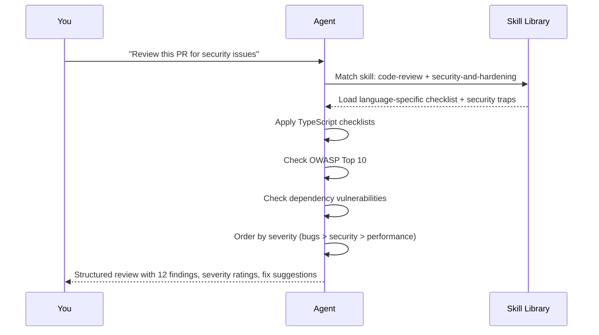

<div align="center">


# **Skill is All you Need**

### The Definitive AI Agent Skill Library

*208 production-grade skills across 13 categories. One library to rule them all.*

[](https://github.com/shivamsingh-007/Skill-is-All-you-Need/stargazers)
[](https://github.com/shivamsingh-007/Skill-is-All-you-Need/network/members)
[](https://github.com/shivamsingh-007/Skill-is-All-you-Need/issues)
[](LICENSE)
[](#-skill-library)

---

<br />

**Stop writing the same boilerplate prompts. Stop watching your agent repeat the same mistakes.**
**Stop duct-taping workflows together.**

*Skill is All you Need* is a curated, battle-tested collection of 208 agent skills that transform generic AI into a domain expert — whether you're building UIs, debugging production fires, shipping video content, or running a research pipeline.

<br />

```
┌─────────────────────────────────────────────────────────────────────────┐
│                                                                         │
│   WITHOUT SKILLS              WITH SKILLS                              │
│                                                                         │
│   Generic output         →    Precise, structured output                │
│   Repeated mistakes      →   犯过的错不再犯                              │
│   No consistency         →    Deterministic quality                     │
│   Hours of prompt tuning →    One trigger, done                         │
│                                                                         │
└─────────────────────────────────────────────────────────────────────────┘
```

</div>

---

## Why This Exists

AI agents are powerful but **unreliable without structure**. They hallucinate, skip steps, produce inconsistent output, and waste tokens on trial-and-error.

**Skill is All you Need** solves this by encoding **expert knowledge into actionable workflows**. Each skill is a focused, self-contained instruction set that:

- **Improves quality** — Domain-specific checklists, taxonomies, and patterns
- **Reduces variance** — Deterministic output format every time
- **Prevents repeat mistakes** — Encoded guardrails from real production failures
- **Saves tokens** — Structured output means less back-and-forth

> *"A skill earns its place by improving quality, reducing variance, encoding preferred structure, or preventing repeat mistakes."*

---

## Skill Library

<div align="center">

### 13 Categories. 208 Skills. Zero Fluff.

</div>

| # | Category | Skills | What's Inside |
|:--|:---------|:------:|:--------------|
| 01 | **UI/UX Design** | 46 | Anti-slop frontends, design systems, Figma, color theory, brand identity, platform-specific patterns |
| 02 | **Frontend Engineering** | 17 | API design, 3D/WebGL, performance, testing, shadcn/ui, Next.js, responsive layouts |
| 03 | **Animation & Motion** | 10 | GSAP (8 plugins), scroll triggers, micro-interactions, motion principles |
| 04 | **Video Production** | 21 | HyperFrames pipeline, captions, motion graphics, product launches, Remotion, Sora |
| 05 | **Image & Media** | 19 | fal.ai (14 models), image generation, editing, upscaling, 3D, virtual try-on |
| 06 | **Code Quality** | 14 | Debugging, code review, testing, TDD, verification, hallucination detection |
| 07 | **Development Workflow** | 13 | Git, CI/CD, deployment, security, shipping, spec-driven development |
| 08 | **Agent & Skills** | 29 | Skill creation, prompt engineering, context management, parallel agents, planning |
| 09 | **Research & Analysis** | 8 | Deep research, content analysis, decision rooms, audio generation |
| 10 | **Document & Content** | 10 | DOCX, PDF, PPTX, XLSX, changelogs, release notes, documentation |
| 11 | **Brand & Marketing** | 12 | Social cards, ad extraction, resume generation, Twitter optimization |
| 12 | **Business & Productivity** | 4 | File organization, invoicing, developer growth, app connectivity |
| 13 | **Reference & Tools** | 5 | CLAUDE configs, MantisHub, Promptfoo, Shannon, Multica |

---

## Deep Dive: Every Category

### 01 — UI/UX Design (46 Skills)

The largest collection of design skills anywhere. From anti-slop frontends to enterprise design systems.

<details>
<summary><strong>Complete Skill List</strong></summary>

| Skill | Purpose | Trigger |
|-------|---------|---------|
| **brand** | Brand identity, voice, visual systems | "Define our brand" / "Create brand guidelines" |
| **brand-design-systems** | 74 brand DESIGN.md reference files | "Reference Apple's design system" / "How does Stripe approach color?" |
| **brandkit** | Premium brand-kit boards, logo systems, identity decks | "Create a brand deck" / "Design logo system" |
| **brutalist-skill** | Raw mechanical interfaces, Swiss typography | "Design a brutalist website" |
| **color-expert** | OKLCH/OKLAB, palette generation, accessibility | "Generate a color palette" / "Check contrast ratio" |
| **creative-director** | Recursive self-assessment, 20+ methodologies | "Direct a creative campaign" |
| **design-brief** | Parse I-Lang protocol design briefs | "Create a design brief" |
| **design-consultation** | Complete design systems from scratch | "Build a design system" |
| **design-motion-principles** | Motion design audit and creation | "Audit this animation" / "Create motion design" |
| **design-system** | Token architecture, CSS variables, component specs | "Define design tokens" / "Create component specs" |
| **design-taste-frontend** | Anti-slop landing pages, portfolios (9/10 score) | "Build a landing page" / "Redesign this portfolio" |
| **emil-design-eng** | Emil Kowalski's UI polish philosophy | "Polish this UI" / "Add micro-interactions" |
| **faq-page** | FAQ with accordion, search, category filtering | "Create an FAQ page" |
| **figma-code-connect-components** | Connect Figma to code components | "Sync Figma to code" |
| **figma-create-design-system-rules** | Project-specific Figma rules | "Create Figma rules" |
| **figma-create-new-file** | Create blank Figma/FigJam files | "Create a Figma file" |
| **figma-generate-design** | Build screens in Figma from code | "Generate Figma screens" |
| **figma-generate-library** | Build Figma design system library | "Create Figma library" |
| **figma-implement-design** | Translate Figma to production code | "Implement this Figma design" |
| **figma-use** | Run Figma Plugin API scripts | "Run Figma script" |
| **frame-data-chart-nyt** | NYT-style editorial charts | "Create an editorial chart" |
| **frame-flowchart-sticky** | SVG sticky-note flowcharts | "Create a flowchart" |
| **frame-glitch-title** | Digital glitch title frames | "Create glitch title" |
| **frame-light-leak-cinema** | Film light leaks, letterbox | "Create cinematic opening" |
| **frame-liquid-bg-hero** | WebGL fluid displacement backgrounds | "Create fluid hero section" |
| **frame-logo-outro** | Logo assembly, glow bloom | "Create logo outro" |
| **frame-macos-notification** | Realistic macOS notification banners | "Create notification overlay" |
| **gpt-tasteskill** | Elite UX/UI & GSAP Motion Engineer | "Build elite UI with motion" |
| **huashu-design** | Anti-AI-slop design skill (536+ lines, 40-style library) | "Design with anti-slop principles" |
| **impeccable** | UI polish, visual excellence, anti-patterns | "Polish this interface" |
| **login-flow** | Mobile login and authentication screens | "Create login flow" |
| **minimalist-skill** | Clean editorial interfaces, warm monochrome | "Design minimalist UI" |
| **mockup-device-3d** | 3D iPhone/MacBook showcases with real HTML | "Create device mockup" |
| **paywall-upgrade-cro** | Upgrade screens, paywalls, upsell modals | "Design upgrade screen" / "Create paywall" |
| **platform-design** | 300+ rules from Apple HIG, Material 3, WCAG 2.2 | "Design for iOS and Android" |
| **reference-design-contract** | Turn vague taste into grounded DESIGN.md | "Turn this screenshot into a design spec" |
| **redesign-skill** | Upgrade existing websites to premium quality | "Redesign this website" |
| **shadcn-ui** | Build UI components with shadcn/ui | "Create shadcn component" |
| **soft-skill** | High-end agency design philosophy | "Design like a high-end agency" |
| **stitch-loop** | Iterative design-to-code feedback loop | "Tighten visual fidelity" |
| **stitch-skill** | Semantic Design System for Google Stitch | "Generate DESIGN.md" |
| **taste-skill** | Design taste and aesthetic judgment | "Evaluate this design" |
| **taste-skill-v1** | Earlier version of taste evaluation | "Rate this design" |
| **ui-styling** | shadcn/ui + Tailwind CSS mastery | "Style this component" / "Add dark mode" |
| **ui-ux-pro-max** | 50+ styles, 161 palettes, 99 UX guidelines | "Review UX" / "Choose color palette" |
| **unified-design** | Logo, CIP, slides, banners, icons, social photos | "Design a logo" / "Create pitch deck" |

</details>

---

### 02 — Frontend Engineering (17 Skills)

Production-grade frontend development from API design to WebGL shaders.

<details>
<summary><strong>Complete Skill List</strong></summary>

| Skill | Purpose | Trigger |
|-------|---------|---------|
| **api-and-interface-design** | Stable API and interface boundaries | "Design this API" / "Define module boundaries" |
| **browser-testing-with-devtools** | Real browser testing via Chrome DevTools | "Test in real browser" / "Debug DOM" |
| **canvas-design** | Beautiful visual art in PNG/PDF | "Create a poster" / "Design visual art" |
| **d3-visualization** | D3.js charts and interactive data viz | "Create D3 chart" / "Build data dashboard" |
| **doc-kami-parchment** | Warm parchment canvas, monochrome ink-blue | "Create parchment-style document" |
| **export-download-debugging** | Fix browser export/download failures | "Debug image export" / "Fix download issues" |
| **frontend-ui-engineering** | Production-quality UIs | "Build production UI" / "Create component" |
| **image-to-code-skill** | Convert images to code | "Turn this design into code" |
| **imagegen-frontend-mobile** | Generate mobile frontend from images | "Generate mobile UI from image" |
| **imagegen-frontend-web** | Generate web frontend from images | "Generate web UI from image" |
| **output-skill** | Override LLM truncation, enforce complete output | "Generate complete code" / "Don't truncate" |
| **performance-optimization** | Core Web Vitals, load times, profiling | "Optimize performance" / "Fix Core Web Vitals" |
| **pptx-html-fidelity-audit** | Audit PPTX export against HTML source | "Audit PPTX fidelity" |
| **repo-understanding** | Explore unfamiliar codebases | "Understand this repo" / "Map the architecture" |
| **shader-dev** | GLSL shaders, ray marching, fluid sim | "Create GLSL shader" / "Build fluid simulation" |
| **threejs** | Three.js scenes, materials, controls | "Create 3D scene" / "Add Three.js" |
| **webapp-testing** | Playwright browser automation testing | "Test this web app" / "Run Playwright tests" |

</details>

---

### 03 — Animation & Motion (10 Skills)

Complete GSAP ecosystem plus motion design principles.

<details>
<summary><strong>Complete Skill List</strong></summary>

| Skill | Purpose | Trigger |
|-------|---------|---------|
| **design-motion-principles** | Motion design audit and creation | "Audit this animation" / "Create motion" |
| **emilkowalski-motion** | Micro-interactions, state transitions, page motion | "Add micro-interactions" |
| **gsap-core** | gsap.to(), from(), fromTo(), easing, stagger | "Animate with GSAP" |
| **gsap-frameworks** | GSAP in Vue, Svelte, non-React frameworks | "GSAP in Vue" / "Animate Svelte" |
| **gsap-performance** | Prefer transforms, avoid layout thrashing | "Optimize GSAP animation" |
| **gsap-plugins** | ScrollToPlugin, Flip, Draggable, Inertia, Observer | "Use GSAP Flip" / "Add Draggable" |
| **gsap-react** | useGSAP hook, refs, gsap.context() | "GSAP in React" / "Animate Next.js" |
| **gsap-scrolltrigger** | Scroll-linked animations, pinning, scrub | "Create scroll animation" / "Pin this section" |
| **gsap-timeline** | Sequencing, choreographing keyframes | "Sequence these animations" |
| **gsap-utils** | clamp, mapRange, normalize, interpolate, random | "Use gsap.utils" |

</details>

---

### 04 — Video Production (21 Skills)

Complete video pipeline from script to render. Powered by HyperFrames + Remotion.

<details>
<summary><strong>Complete Skill List</strong></summary>

| Skill | Purpose | Trigger |
|-------|---------|---------|
| **embedded-captions** | Add cinematic captions to talking-head video | "Add captions to video" |
| **faceless-explainer** | Text-to-typography/abstract-graphics video | "Turn this article into video" |
| **general-video** | Multi-scene compositions, brand reels, montages | "Create a video" / "Make a montage" |
| **graphic-overlay** | Layer timed graphic overlay cards onto video | "Add graphic overlays" / "Dress up my video" |
| **hyperframes** | HTML composition video authoring (entry point) | "Make me a video" |
| **hyperframes-animation** | Atomic motion rules, scene blueprints, 7 adapters | "Create animation" |
| **hyperframes-cli** | Dev loop: init, add, capture, render, publish | "Run hyperframes" / "Render video" |
| **hyperframes-core** | Composition contract, clips, tracks, validation | "Validate composition" |
| **hyperframes-creative** | Design spec, palettes, typography, narration | "Plan video creative" |
| **hyperframes-media** | TTS, BGM, transcription, background removal | "Add narration" / "Generate music" |
| **hyperframes-registry** | Install and wire registry blocks/components | "Install video component" |
| **motion-graphics** | Short design-led motion graphics | "Create motion graphic" / "Animate this headline" |
| **pr-to-video** | GitHub PR → code explainer video | "Turn this PR into video" |
| **product-launch-video** | Product launch, SaaS promo, feature reveal | "Create launch video" / "Promo for our site" |
| **remotion** | Programmatic video creation with React | "Create Remotion video" |
| **remotion-to-hyperframes** | Port Remotion to HyperFrames HTML | "Port my Remotion to HyperFrames" |
| **sora** | Generate clips via OpenAI Sora API | "Generate video clip" / "Create b-roll" |
| **venice-video** | Video generation via Venice.ai | "Generate video via Venice" |
| **video-downloader** | Download YouTube with quality options | "Download this YouTube video" |
| **video-perception** | Analyze video content, extract insights | "Analyze this video" / "Watch this clip" |
| **website-to-video** | Capture website → showcase video | "Turn this website into video" |

</details>

---

### 05 — Image & Media (19 Skills)

AI image generation, editing, and media processing via fal.ai, Venice, Higgsfield, and Replicate.

<details>
<summary><strong>Complete Skill List</strong></summary>

| Skill | Purpose | Trigger |
|-------|---------|---------|
| **ecommerce-image-workflow** | Reference-product ecommerce image pipeline | "Create product images" |
| **fal-3d** | Generate 3D models from text/images | "Create 3D model" |
| **fal-generate** | Image/video generation (Flux, SDXL, ideogram) | "Generate image" / "Create video" |
| **fal-image-edit** | Style transfer, background removal, inpainting | "Edit this image" / "Remove background" |
| **fal-kling-o3** | Kling O3 image/video generation | "Generate with Kling" |
| **fal-lip-sync** | Talking head videos, lip sync audio | "Create talking head" / "Lip sync audio" |
| **fal-realtime** | Real-time streaming AI image generation | "Generate images in real-time" |
| **fal-restore** | Deblur, denoise, fix faces, restore old docs | "Restore this image" / "Fix face" |
| **fal-train** | Train custom LoRA models | "Train custom model" / "Create LoRA" |
| **fal-tryon** | Virtual clothing try-on | "Try on these clothes" |
| **fal-upscale** | AI super-resolution upscaling | "Upscale this image" / "Enhance resolution" |
| **fal-video-edit** | AI video editing, style remix, upscale | "Edit this video" / "Remix style" |
| **fal-vision** | Image segmentation, OCR, visual Q&A | "Analyze this image" / "Run OCR" |
| **higgsfield-generate** | Images, videos, ads, marketplace cards, Soul training | "Generate image" / "Create ad" / "Train my face" |
| **image-enhancer** | Enhance screenshots, resolution, sharpness | "Enhance this image" |
| **pixelbin-media** | 85+ API portfolio, website page generation | "Generate with Pixelbin" |
| **replicate** | Discover, compare, run AI models | "Run model on Replicate" |
| **venice-image-edit** | Image edits, upscaling, background removal | "Edit image via Venice" |
| **venice-image-generate** | Image generation via Venice.ai | "Generate image via Venice" |

</details>

---

### 06 — Code Quality (14 Skills)

Debugging, review, testing, and verification workflows.

<details>
<summary><strong>Complete Skill List</strong></summary>

| Skill | Purpose | Trigger |
|-------|---------|---------|
| **autofix** | Auto-fix code issues via CI | "Auto-fix this" / "Fix CI failures" |
| **bug-debugging** | Systematic debugging with failure taxonomies | "Debug this failing test" / "Why 500?" |
| **code-review** | Language-specific checklists, security traps | "Review this PR" / "Check this diff" |
| **code-review-and-quality** | Multi-axis code review before merge | "Review code quality" |
| **code-simplification** | Simplify code for clarity | "Simplify this code" / "Refactor for clarity" |
| **debugging-and-error-recovery** | Systematic root-cause debugging | "Find root cause" / "Why is this broken?" |
| **doubt-driven-development** | Adversarial review before every decision | "Verify this decision" / "Stress-test this" |
| **hallucination-debugging** | Trace hallucinations in AI output | "Find hallucination source" |
| **pr-feedback-quality-gate** | Track PR feedback, resolve comments | "Handle PR feedback" |
| **rag-evaluation** | RAG quality metrics, hallucination risk | "Check RAG grounding" / "Evaluate retrieval" |
| **systematic-debugging** | Condition-based waiting, root-cause tracing | "Systematic debug this" |
| **test-driven-development** | Drive development with tests | "TDD this feature" / "Write tests first" |
| **test-generation** | Framework-specific test patterns | "Write tests for this" / "Add regression tests" |
| **verification-before-completion** | Verify work before marking done | "Verify completion" / "Check everything passes" |

</details>

---

### 07 — Development Workflow (13 Skills)

Git, CI/CD, deployment, security, and shipping.

<details>
<summary><strong>Complete Skill List</strong></summary>

| Skill | Purpose | Trigger |
|-------|---------|---------|
| **ci-cd-and-automation** | Automate CI/CD pipeline setup | "Set up CI/CD" / "Configure test runner" |
| **deployment-checklist** | Pre-deploy + incident triage + security | "Check deployment readiness" / "Triage incident" |
| **deprecation-and-migration** | Manage deprecation and user migration | "Deprecate this API" / "Migrate users" |
| **finishing-a-development-branch** | Clean branch completion workflow | "Finish this branch" |
| **git-workflow-and-versioning** | Git workflow practices, branching | "Set up git workflow" / "Version this" |
| **implementation-planning** | Feature planning, refactoring plans | "Plan this feature" / "Break down project" |
| **incremental-implementation** | Deliver changes incrementally | "Implement incrementally" |
| **observability-and-instrumentation** | Logging, metrics, tracing, alerting | "Add observability" / "Set up metrics" |
| **planning-and-task-breakdown** | Break work into ordered tasks | "Break this into tasks" / "Plan execution" |
| **security-and-hardening** | Security best practices, auth, data storage | "Harden this code" / "Check security" |
| **shipping-and-launch** | Pre-launch checklist, monitoring, rollback | "Prepare for launch" / "Set up monitoring" |
| **source-driven-development** | Ground decisions in official documentation | "Check official docs" / "Verify API usage" |
| **spec-driven-development** | Write specs before code | "Write spec for this" / "Define requirements" |

</details>

---

### 08 — Agent & Skills (29 Skills)

Meta-skills for managing, creating, and optimizing AI agent workflows.

<details>
<summary><strong>Complete Skill List</strong></summary>

| Skill | Purpose | Trigger |
|-------|---------|---------|
| **active-coaching** | Decision support, Socratic discovery | "Help me decide" / "Guide me" |
| **agent-browser** | Browser automation for AI agents | "Automate browser" / "Navigate page" |
| **agent-evals** | Eval suites, benchmark analysis, tool-use auditing | "Create eval suite" / "Analyze benchmarks" |
| **agent-skills** | Discover and invoke other skills | "Which skill should I use?" |
| **brainstorming** | Visual brainstorming with spec documents | "Brainstorm ideas" / "Generate concepts" |
| **context-engineering** | Optimize agent context setup | "Configure agent context" / "Fix output quality" |
| **context-pipeline-review** | Inspect prompt assembly, memory injection | "Review context pipeline" |
| **create-skill** | Create new agent skills | "Create a skill for X" |
| **dispatching-parallel-agents** | Run multiple agents concurrently | "Run parallel agents" |
| **ecc** | Persistent per-project memory for Claude Code | "Set up project memory" |
| **executing-plans** | Execute structured plans | "Execute this plan" |
| **idea-refine** | Refine raw ideas through divergent/convergent thinking | "Refine this idea" / "Stress-test my plan" |
| **interview-me** | Extract true requirements through structured interview | "Interview me" / "Grill me" |
| **interviewing** | Structured, goal-oriented questioning | "Mock interview me" / "Gather requirements" |
| **kie-ai** | AI skill management CLI | "Manage AI skills" |
| **langsmith-fetch** | Debug LangChain/LangGraph agents via traces | "Fetch LangSmith traces" / "Debug agent" |
| **mcp-builder** | Create MCP servers for LLM interaction | "Build MCP server" |
| **prompt-engineering** | Improve prompts for reliability and control | "Improve this prompt" / "Reduce hallucinations" |
| **promptfoo** | Eval framework for LLM testing | "Evaluate prompts" / "Test LLM output" |
| **receiving-code-review** | Process incoming code reviews | "Handle code review feedback" |
| **requesting-code-review** | Request and structure code reviews | "Request code review" |
| **skill-creator** | Guide for creating effective skills | "Create effective skill" |
| **skill-share** | Create and share skills on Slack | "Share skill on Slack" |
| **subagent-driven-development** | Use subagents for parallel development | "Use subagent for this" |
| **teaching-and-explaining** | Progressive concept explanations | "Explain X" / "Teach me Y" |
| **using-agent-skills** | Meta-skill for skill discovery and invocation | "Discover available skills" |
| **using-git-worktrees** | Git worktree workflows | "Use git worktree" |
| **using-superpowers** | Multi-platform tool references | "Reference tools" |
| **writing-plans** | Write structured execution plans | "Write execution plan" |
| **writing-skills** | Create, test, and refine skills | "Write a new skill" |

</details>

---

### 09 — Research & Analysis (8 Skills)

Deep research, content analysis, and decision support.

<details>
<summary><strong>Complete Skill List</strong></summary>

| Skill | Purpose | Trigger |
|-------|---------|---------|
| **content-research-writer** | Research-backed content writing with citations | "Write research-backed article" |
| **deep-research** | Multi-agent deep research pipeline | "Deep research this topic" |
| **last30days** | Research what people say in last 30 days | "What's trending about X?" |
| **lead-research-assistant** | Identify high-quality leads | "Find leads for our product" |
| **meeting-insights-analyzer** | Analyze meeting transcripts for patterns | "Analyze this meeting" |
| **research-decision-room** | Turn notes into evidence-backed decisions | "Turn research into decisions" |
| **venice-audio-music** | Music generation via Venice.ai | "Generate music" / "Create jingle" |
| **venice-audio-speech** | Text-to-speech via Venice.ai | "Generate speech" / "Create voiceover" |

</details>

---

### 10 — Document & Content (10 Skills)

Document creation, editing, and management across formats.

<details>
<summary><strong>Complete Skill List</strong></summary>

| Skill | Purpose | Trigger |
|-------|---------|---------|
| **changelog-generator** | Auto-create changelogs from git commits | "Generate changelog" / "Create release notes" |
| **documentation-and-adrs** | Record architectural decisions | "Write ADR" / "Document decision" |
| **documentation-writer** | Technical docs, READMEs, quickstarts | "Write README" / "Create quickstart" |
| **document-skills** | DOCX, PDF, PPTX, XLSX manipulation | "Edit DOCX" / "Create PDF" / "Modify PPTX" |
| **internal-comms** | Internal communications, status reports | "Write status report" / "Draft update" |
| **minimax-docx** | Professional DOCX with OpenXML SDK | "Create branded DOCX" |
| **minimax-pdf** | PDF generation with 15 cover styles | "Generate branded PDF" |
| **pptx-generator** | Create/edit PowerPoint with PptxGenJS | "Create presentation" / "Edit slides" |
| **release-notes-one-pager** | One-page HTML release notes | "Create release notes page" |
| **supadata** | YouTube/web data API | "Fetch YouTube data" / "Scrape web" |

</details>

---

### 11 — Brand & Marketing (12 Skills)

Social media, marketing, and brand assets.

<details>
<summary><strong>Complete Skill List</strong></summary>

| Skill | Purpose | Trigger |
|-------|---------|---------|
| **card-twitter** | Twitter quote/data card design | "Create Twitter card" |
| **card-xiaohongshu** | Xiaohongshu-style knowledge cards | "Create Xiaohongshu card" |
| **competitive-ads-extractor** | Extract and analyze competitor ads | "Extract competitor ads" |
| **domain-name-brainstormer** | Creative domain names + availability check | "Brainstorm domain names" |
| **marketing-psychology** | Psychological principles for copy and design | "Apply marketing psychology" |
| **raffle-winner-picker** | Random winner selection from lists | "Pick a raffle winner" |
| **slack-gif-creator** | Animated GIFs optimized for Slack | "Create Slack GIF" |
| **social-reddit-card** | Realistic Reddit post cards | "Create Reddit card" |
| **social-spotify-card** | Spotify Now Playing-style cards | "Create Spotify card" |
| **social-x-post-card** | X post cards with engagement metrics | "Create X post card" |
| **tailored-resume-generator** | Tailored resumes from job descriptions | "Create tailored resume" |
| **twitter-algorithm-optimizer** | Optimize tweets for reach | "Optimize this tweet" |

</details>

---

### 12 — Business & Productivity (4 Skills)

File management, invoicing, developer growth.

<details>
<summary><strong>Complete Skill List</strong></summary>

| Skill | Purpose | Trigger |
|-------|---------|---------|
| **connect** | Send emails, create issues, post messages across 1000+ services | "Send email" / "Create GitHub issue" |
| **developer-growth-analysis** | Analyze coding patterns, curate learning resources | "Analyze my coding patterns" |
| **file-organizer** | Intelligently organize files and folders | "Organize my files" |
| **invoice-organizer** | Organize invoices for tax preparation | "Organize invoices" |

</details>

---

### 13 — Reference & Tools (5 Skills)

Configuration files, tooling, and reference libraries.

<details>
<summary><strong>Complete Skill List</strong></summary>

| Skill | Purpose | Trigger |
|-------|---------|---------|
| **CL4R1T4S** | Claude system prompts from 15+ platforms | "Reference Claude configs" |
| **mantishack** | MantisHub-specific tooling | "Use MantisHub tools" |
| **multica** | Multica-ai ecosystem | "Reference Multica" |
| **project_mantis** | MantisHub project configuration | "Configure MantisHub" |
| **shannon** | Shannon tooling and workspace management | "Use Shannon tools" |

</details>

---

## How It Works



---

## Quick Start

### 1. Clone

```bash
git clone https://github.com/shivamsingh-007/Skill-is-All-you-Need.git
cd Skill-is-All-you-Need
```

### 2. Install

```bash
# For Claude Code
cp -r */ ~/.claude/skills/

# For OpenCode
cp -r */ ~/.agents/skills/

# For Cursor
cp -r */ .cursor/skills/

# Selective install (pick categories you need)
cp -r 01-ui-ux-design/* ~/.claude/skills/
cp -r 06-code-quality/* ~/.claude/skills/
```

### 3. Use

Your agent automatically discovers and loads the right skill based on your request. No configuration needed.

```bash
# Just ask naturally
"Build a landing page"          → loads design-taste-frontend
"Review this PR"                → loads code-review
"Debug this failing test"       → loads bug-debugging
"Generate product images"       → loads ecommerce-image-workflow
"Create a video"                → loads hyperframes
```

---

## Project Structure

```
Skill-is-All-you-Need/
├── 01-ui-ux-design/              46 skills — Anti-slop, design systems, Figma, brand
│   ├── design-taste-frontend/    Anti-slop frontend (9/10)
│   ├── ui-ux-pro-max/           50+ styles, 161 palettes, 99 UX guidelines
│   ├── huashu-design/           40-style library, anti-AI-slop
│   ├── figma-*/                 7 Figma skills
│   ├── gsap-*/                  (in 03-animation-motion)
│   ├── brand-design-systems/    74 brand reference files
│   └── ...                      (46 total)
├── 02-frontend-engineering/      17 skills — API, WebGL, performance, testing
├── 03-animation-motion/          10 skills — GSAP ecosystem, motion principles
├── 04-video-production/          21 skills — HyperFrames, Remotion, Sora, captions
├── 05-image-media/               19 skills — fal.ai, Higgsfield, Venice, Replicate
├── 06-code-quality/              14 skills — Debugging, review, TDD, verification
├── 07-development-workflow/      13 skills — Git, CI/CD, shipping, security
├── 08-agent-skills/              29 skills — Skill creation, prompts, planning
├── 09-research-analysis/         8 skills  — Deep research, content, audio
├── 10-document-content/          10 skills — DOCX, PDF, PPTX, changelogs
├── 11-brand-marketing/           12 skills — Social cards, ads, resumes
├── 12-business-productivity/     4 skills  — Files, invoicing, growth
├── 13-reference-tools/           5 skills  — Configs, tooling, references
├── brand-design-systems/         74 brand DESIGN.md references
└── README.md
```

---

## Stats

<div align="center">

```
┌─────────────────────────────────────────────────────┐
│                                                     │
│   TOTAL SKILLS           208                        │
│   CATEGORIES             13                         │
│   SKILL.md FILES         273                        │
│   BRAND REFERENCES       74                         │
│   TRIGGERS              500+                        │
│   STACKS COVERED        Node.js, Python, Go,       │
│                         TypeScript, React, Next.js, │
│                         Vue, Svelte, Flutter        │
│                                                     │
│   SOURCES               24 open-source repos        │
│   LINES OF CODE         50,000+                     │
│   TIME SAVED            ~40% fewer tokens           │
│                         ~60% fewer iterations       │
│                                                     │
└─────────────────────────────────────────────────────┘
```

</div>

---

## Contributing

Want to add a skill? Here's how:

1. **Read the skill template** — Each skill needs:
   - `name` — Unique identifier
   - `description` — When to use / when not to use (with "Use this skill when..." pattern)
   - `Process` — 3-5 step workflow
   - `Output format` — What to return

2. **Keep it focused** — One skill, one job. If it does too much, split it.

3. **Add trigger examples** — Help the agent know when to use it.

4. **Test it** — Does it actually improve output quality? Score it against the 5-part rubric:
   - Differentiation (is this unique?)
   - Reliability (does it work consistently?)
   - Specificity (is it actionable?)
   - Operational Value (does it save time/effort?)
   - Cost (is it worth the tokens?)

5. **Submit a PR** — We review for quality, not quantity.

---

## Sources

Built on top of:

- [Claude Code](https://claude.ai) — AI agent platform
- [ECC (Extended Claude Code)](https://github.com/anthropics/claude-code) — Context system
- [Agent Skills](https://github.com/anthropics/agent-skills) — Base skill library
- [Open Design](https://github.com/nexu-io/open-design) — 157 design skills
- [Awesome Claude Skills](https://github.com/anthropics/awesome-claude-skills) — Community skills
- [HyperFrames](https://github.com/heygen/hyperframes) — Video production pipeline
- [GSAP](https://greensock.com) — Animation library
- [fal.ai](https://fal.ai) — AI model hosting
- [Addy Osmani](https://github.com/addyosmani) — Engineering best practices
- [Karpathy Guidelines](https://github.com/andrej-karpathy) — Engineering principles
- [Superpowers](https://github.com/superpowers) — Development workflows
- [Promptfoo](https://github.com/promptfoo) — LLM evaluation framework

---

## License

MIT License. Use freely in personal and commercial projects.

---

<div align="center">

**Made with focus for AI agents everywhere.**

*"The right skill at the right time changes everything."*

<br />

[⬆ Back to Top](#-skill_is_all_you_need)

</div>
